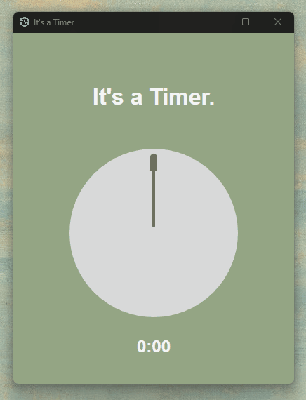

# This is a Timer

This is a simple Timer built using Tauri + React + Typescript + Vite.


This timer is designed to assist with focused studying and work, utilizing the [Pomodoro Technique](https://en.wikipedia.org/wiki/Pomodoro_Technique). The Pomodoro Technique is a time management method that breaks work into intervals, traditionally 25 minutes in length, separated by short breaks. This timer will help you stay organized and maintain productivity by providing a structured approach to your tasks.




## Dependencies

Before getting started, make sure you have the following dependencies installed on your system:

- [Node.js](https://nodejs.org/en) and [npm](https://www.npmjs.com/) - JavaScript runtime for executing JavaScript and Package manager for JavaScript
- [Tauri](https://tauri.app/v1/guides/getting-started/prerequisites) - Tauri's environment needs Rust and system dependencies.


##  Installation and Usage

Clone the repository:
```bash
git clone git@github.com:EvenZHAnglll/This-is-a-Timer.git
```

Navigate to the project directory:
```bash
cd this-is-a-timer
```

Install the dependencies:
```BASH
npm install
```

Start the application:
```BASH
npm run tauri dev
```

Build the application:
```bash
npm run tauri build
```


## Furthermore
This project serves as a personal endeavor to learn Tauri development. By building this timer application, I aim to gain hands-on experience with Tauri and enhance my skills in Typescript + React.

Feel free to reach out if you have any questions or suggestions regarding this project!

Let me know if there's anything else I can assist you with!